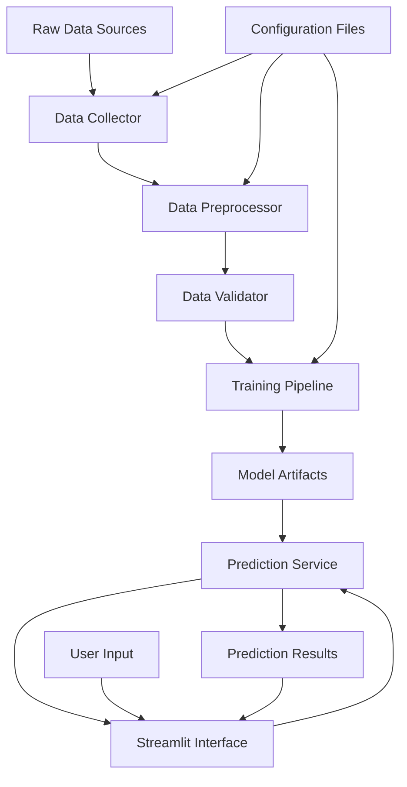

# 🏗️ Stack Breakdown - App Security Risk Predictor

## Project Architecture Overview

This project follows a **modular architecture** with clear separation of concerns, making it scalable, maintainable, and production-ready.

```
┌─────────────────────────────────────────────────────────────┐
│                    PRESENTATION LAYER                       │
├─────────────────────────────────────────────────────────────┤
│  Streamlit Web Interface  │  CLI Tools  │  API Endpoints    │
│  (User Interaction)       │  (Scripts)  │  (Future)         │
└─────────────────────────────────────────────────────────────┘
                                │
┌─────────────────────────────────────────────────────────────┐
│                    APPLICATION LAYER                        │
├─────────────────────────────────────────────────────────────┤
│  Model Interface  │  Training Manager  │  Data Processor   │
│  (Predictions)    │  (ML Training)     │  (ETL Pipeline)   │
└─────────────────────────────────────────────────────────────┘
                                │
┌─────────────────────────────────────────────────────────────┐
│                      DATA LAYER                             │
├─────────────────────────────────────────────────────────────┤
│  Raw Data  │  Processed Data  │  Model Artifacts  │  Config │
│  (CSV)     │  (Cleaned)       │  (H5, PKL)        │  (YAML) │
└─────────────────────────────────────────────────────────────┘
```

## 📂 Directory Structure

```
app-security-predictor/
├── 📁 src/                          # Source code modules
│   ├── 📁 data/                     # Data handling modules
│   │   ├── __init__.py
│   │   ├── collector.py             # Data collection & generation
│   │   ├── preprocessor.py          # Data preprocessing
│   │   └── validator.py             # Data validation
│   │
│   ├── 📁 models/                   # Model architecture & utilities
│   │   ├── __init__.py
│   │   ├── neural_network.py        # Deep learning architecture
│   │   ├── predictor.py             # Prediction interface
│   │   └── evaluator.py             # Model evaluation
│   │
│   ├── 📁 training/                 # Training pipeline
│   │   ├── __init__.py
│   │   ├── trainer.py               # Training orchestrator
│   │   ├── callbacks.py             # Training callbacks
│   │   └── hyperparameters.py       # Hyperparameter management
│   │
│   └── 📁 interface/                # User interfaces
│       ├── __init__.py
│       ├── streamlit_app.py         # Web interface
│       ├── components.py            # UI components
│       └── visualizations.py        # Chart & plot utilities
│
├── 📁 config/                       # Configuration files
│   ├── model_config.yaml            # Model hyperparameters
│   ├── data_config.yaml             # Data processing settings
│   └── app_config.yaml              # Application settings
│
├── 📁 scripts/                      # Standalone scripts
│   ├── generate_data.py             # Data generation script
│   ├── train_model.py               # Model training script
│   ├── evaluate_model.py            # Model evaluation script
│   └── deploy.py                    # Deployment script
│
├── 📁 data/                         # Data storage
│   ├── raw/                         # Raw datasets
│   ├── processed/                   # Cleaned datasets
│   └── external/                    # External data sources
│
├── 📁 models/                       # Trained models
│   ├── checkpoints/                 # Training checkpoints
│   ├── production/                  # Production models
│   └── experiments/                 # Experimental models
│
├── 📁 notebooks/                    # Jupyter notebooks
│   ├── data_exploration.ipynb       # EDA notebook
│   ├── model_development.ipynb      # Model dev notebook
│   └── evaluation_analysis.ipynb    # Results analysis
│
├── 📁 tests/                        # Unit tests
│   ├── test_data.py
│   ├── test_models.py
│   └── test_training.py
│
├── 📁 docs/                         # Documentation
│   ├── api_reference.md
│   ├── deployment_guide.md
│   └── user_manual.md
│
├── requirements/                    # Environment requirements
│   ├── base.txt                     # Core dependencies
│   ├── development.txt              # Dev dependencies
│   └── production.txt               # Production dependencies
│
├── app.py                          # Main Streamlit entry point
├── requirements.txt                # All dependencies
├── README.md                       # Main documentation
├── STACK_BREAKDOWN.md              # This file
└── docker-compose.yml              # Container orchestration
```

## 🔧 Technology Stack Breakdown

### 1. **DATA LAYER** 🗄️

#### Core Technologies
- **Pandas** (2.2.0+): Data manipulation and analysis
- **NumPy** (1.24.0+): Numerical computing
- **CSV Format**: Data storage and exchange

#### Purpose & Necessity
- **Essential**: Data is the foundation of ML models
- **Scalability**: Pandas handles datasets up to several GB
- **Interoperability**: CSV format ensures compatibility

#### Components
```python
# src/data/collector.py - Data Collection
- Synthetic data generation
- External API integration (future)
- Data ingestion pipelines

# src/data/preprocessor.py - Data Processing  
- Feature engineering
- Data cleaning and validation
- Scaling and normalization

# src/data/validator.py - Data Quality
- Schema validation
- Data quality checks
- Anomaly detection
```

### 2. **MODEL LAYER** 🧠

#### Core Technologies
- **TensorFlow/Keras** (2.15.0+): Deep learning framework
- **Scikit-learn** (1.4.0+): ML utilities and preprocessing
- **Joblib** (1.3.0+): Model serialization

#### Purpose & Necessity
- **Critical**: Core ML functionality
- **Performance**: TensorFlow optimized for neural networks
- **Ecosystem**: Scikit-learn provides complementary tools

#### Components
```python
# src/models/neural_network.py - Architecture
- Model architecture definition
- Layer configurations
- Optimization settings

# src/models/predictor.py - Inference
- Prediction interface
- Batch processing
- Confidence scoring

# src/models/evaluator.py - Assessment
- Performance metrics
- Model validation
- Comparison utilities
```

### 3. **TRAINING LAYER** 🏋️

#### Core Technologies
- **TensorFlow Callbacks**: Training control
- **MLflow** (optional): Experiment tracking
- **Weights & Biases** (optional): Advanced monitoring

#### Purpose & Necessity
- **Essential**: Manages model training lifecycle
- **Reproducibility**: Ensures consistent training results
- **Monitoring**: Tracks training progress and metrics

#### Components
```python
# src/training/trainer.py - Training Orchestration
- Training pipeline management
- Hyperparameter handling
- Model checkpointing

# src/training/callbacks.py - Training Control
- Early stopping
- Learning rate scheduling
- Custom metrics logging

# src/training/hyperparameters.py - Parameter Management
- Hyperparameter optimization
- Configuration management
- Experiment tracking
```

### 4. **INTERFACE LAYER** 🖥️

#### Core Technologies
- **Streamlit** (1.29.0+): Web interface framework
- **Plotly** (5.17.0+): Interactive visualizations
- **Matplotlib/Seaborn**: Static plotting

#### Purpose & Necessity
- **User Experience**: Essential for non-technical users
- **Visualization**: Critical for understanding model behavior
- **Accessibility**: Web-based interface requires no installation

#### Components
```python
# src/interface/streamlit_app.py - Main Interface
- Page routing and navigation
- User input handling
- Session state management

# src/interface/components.py - UI Components
- Reusable UI elements
- Form components
- Interactive widgets

# src/interface/visualizations.py - Charts & Plots
- Risk distribution charts
- Feature importance plots
- Performance metrics visualization
```

### 5. **CONFIGURATION LAYER** ⚙️

#### Core Technologies
- **YAML**: Configuration files
- **Python ConfigParser**: Configuration management
- **Environment Variables**: Runtime configuration

#### Purpose & Necessity
- **Maintainability**: Centralized configuration management
- **Flexibility**: Easy parameter adjustment without code changes
- **Deployment**: Environment-specific configurations

#### Configuration Files
```yaml
# config/model_config.yaml
model:
  architecture:
    layers: [256, 128, 64, 32]
    dropout_rates: [0.3, 0.3, 0.2, 0.2]
    activation: 'relu'
  training:
    epochs: 50
    batch_size: 32
    learning_rate: 0.001

# config/data_config.yaml
data:
  features:
    categorical: ['category', 'os_type', 'app_store']
    numerical: ['app_size_mb', 'rating', 'install_count']
  preprocessing:
    scaling_method: 'standard'
    encoding_method: 'label'
```

## 🚀 Deployment Stack Options

### **Option 1: Development Stack** (Minimal)
```yaml
Required Components:
- Python 3.8+
- Core ML libraries (TensorFlow, Scikit-learn)
- Streamlit for interface
- Local file storage

Resource Requirements:
- RAM: 4GB minimum
- Storage: 1GB
- CPU: 2+ cores
```

### **Option 2: Production Stack** (Recommended)
```yaml
Required Components:
- All development components
- Docker containerization
- PostgreSQL/MongoDB for data storage
- Redis for caching
- Nginx for load balancing

Resource Requirements:
- RAM: 8GB minimum
- Storage: 10GB
- CPU: 4+ cores
- GPU: Optional (CUDA-compatible)
```

### **Option 3: Enterprise Stack** (Full-Scale)
```yaml
Required Components:
- Kubernetes orchestration
- Microservices architecture
- Message queues (RabbitMQ/Apache Kafka)
- Monitoring (Prometheus, Grafana)
- CI/CD pipeline (Jenkins/GitHub Actions)
- Cloud storage (AWS S3/GCP Storage)

Resource Requirements:
- Scalable cloud infrastructure
- Load balancers
- Multi-region deployment
- Backup and disaster recovery
```

## 📊 Dependency Priority Matrix

### **CRITICAL** (Cannot function without)
| Component | Purpose | Alternatives |
|-----------|---------|--------------|
| Python 3.8+ | Runtime environment | None |
| TensorFlow | Deep learning | PyTorch |
| Pandas | Data manipulation | Polars, Dask |
| NumPy | Numerical computing | None |
| Streamlit | Web interface | Flask, Django |

### **IMPORTANT** (Significantly impacts functionality)
| Component | Purpose | Alternatives |
|-----------|---------|--------------|
| Scikit-learn | ML utilities | Custom implementations |
| Plotly | Interactive plots | Bokeh, Altair |
| Joblib | Model serialization | Pickle, Dill |

### **OPTIONAL** (Enhances experience)
| Component | Purpose | Alternatives |
|-----------|---------|--------------|
| Matplotlib | Static plotting | Seaborn only |
| Seaborn | Statistical plots | Matplotlib only |
| Docker | Containerization | Virtual environments |

## 🔄 Data Flow Architecture



## 🧪 Testing Strategy

### **Unit Tests** (Individual Components)
```python
tests/
├── test_data_collector.py      # Data generation tests
├── test_preprocessor.py        # Data processing tests
├── test_neural_network.py      # Model architecture tests
├── test_predictor.py           # Prediction logic tests
└── test_interface.py           # UI component tests
```

### **Integration Tests** (Component Interaction)
```python
tests/integration/
├── test_training_pipeline.py   # End-to-end training
├── test_prediction_pipeline.py # End-to-end prediction
└── test_data_flow.py           # Data processing flow
```

### **Performance Tests** (System Performance)
```python
tests/performance/
├── test_model_speed.py         # Inference speed tests
├── test_memory_usage.py        # Memory profiling
└── test_scalability.py         # Load testing
```

## 📈 Scalability Considerations

### **Horizontal Scaling**
- **Data Processing**: Parallel data processing with Dask
- **Model Serving**: Multiple model instances behind load balancer
- **Storage**: Distributed storage systems

### **Vertical Scaling**
- **Memory**: Increased RAM for larger datasets
- **CPU**: More cores for faster training
- **GPU**: CUDA acceleration for deep learning

### **Cloud Scaling**
- **Auto-scaling**: Dynamic resource allocation
- **Serverless**: AWS Lambda, Google Cloud Functions
- **Managed Services**: Cloud ML platforms

## 🔐 Security Stack

### **Data Security**
- Encryption at rest and in transit
- Access control and authentication
- Data anonymization and privacy protection

### **Model Security**
- Model versioning and integrity checks
- Adversarial attack protection
- Secure model deployment

### **Infrastructure Security**
- Container security scanning
- Network security policies
- Monitoring and alerting

---

**This modular architecture ensures:**
- ✅ **Maintainability**: Clear separation of concerns
- ✅ **Scalability**: Easy to scale individual components
- ✅ **Testability**: Isolated components for testing
- ✅ **Reusability**: Components can be reused across projects
- ✅ **Flexibility**: Easy to swap implementations